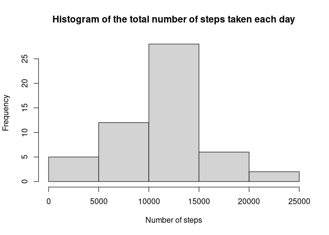
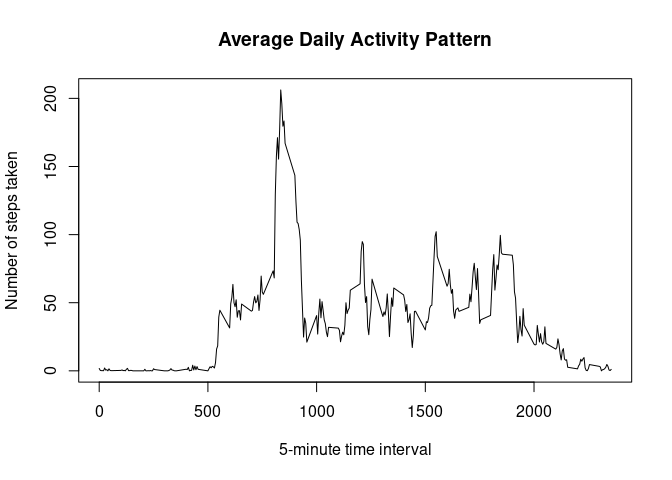
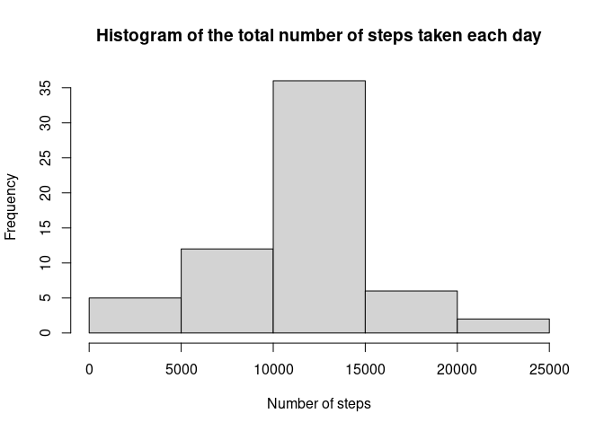
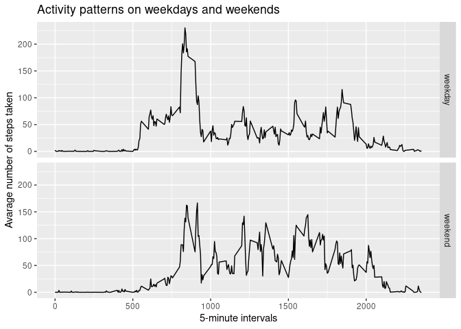

## Loading and preprocessing the data
### 1. Code for reading in the dataset and/or processing the data


```r
# unzip the file and read the csv file
unzip("activity.zip")
df <- read.csv("activity.csv", colClasses = c("integer", "Date", "integer"))
```

## What is mean total number of steps taken per day?
### 2. Histogram of the total number of steps taken each day


```r
# aggregate steps by dates using sum function
total_steps_per_day <-  aggregate(list(steps = df$steps), 
                                  by = list(dates = df$date), FUN = sum)

# plot a histogram
hist(total_steps_per_day$steps,
     main = "Histogram of the total number of steps taken each day",
     xlab = "Number of steps")
```

<!-- -->

### 3. Mean and median number of steps taken each day


```r
# calculate mean steps per day
mean_total_steps_per_day <- mean(total_steps_per_day$steps, na.rm = TRUE)
print(paste("mean number of steps: ", round(mean_total_steps_per_day, 2)))
```

```
## [1] "mean number of steps:  10766.19"
```

```r
# calculate median steps per day
median_total_steps_per_day <- median(total_steps_per_day$steps, na.rm = TRUE)
print(paste("median number of steps: ", round(median_total_steps_per_day, 2)))
```

```
## [1] "median number of steps:  10765"
```


## What is the average daily activity pattern?

### 4. Time series plot of the average number of steps taken


```r
# aggregate number of steps by time intervals
mean_steps_per_interval <-  aggregate(list(steps = df$steps), 
                                        by = list(interval = df$interval),
                                        FUN = mean, na.rm = TRUE,
                                        na.action = na.omit)

# plot number of steps against time interval
plot(mean_steps_per_interval$interval, 
     mean_steps_per_interval$steps, type = "l",
     main = "Average Daily Activity Pattern",
     xlab = "5-minute time interval",
     ylab = "Number of steps taken")
```

<!-- -->

### 5. The 5-minute interval that, on average, contains the maximum number of steps

```r
# find index of the row with max steps
index_max_value <- which.max(mean_steps_per_interval$steps)
print(paste("time interval with max steps: ", 
            mean_steps_per_interval[index_max_value, 1]))
```

```
## [1] "time interval with max steps:  835"
```

## Imputing missing values
### 6. Code to describe and show a strategy for imputing missing data

```r
# Calculate the total number of missing values in the dataset
missing_nas <- sum(is.na(df$steps))
print(paste("total number of missing values: ", missing_nas))
```

```
## [1] "total number of missing values:  2304"
```

```r
# create a copy of dataframe to fill in missing values
df_imputed <- data.frame(df)

# devise a strategy for filling in all of the missing values in the dataset. 
# impute na values with mean steps on that time interval.
for (index_value in 1:nrow(df_imputed)) {
        if (is.na(df_imputed[index_value, 1])) {
            df_imputed[index_value, 1] <- mean_steps_per_interval[mean_steps_per_interval$interval == df_imputed[index_value, 3], 2]
        }
}
```


```r
# Make a histogram of the total number of steps taken each day
total_steps_per_day_imputed <-  aggregate(list(steps = df_imputed$steps), 
                                       by = list(dates = df_imputed$date), FUN = sum)

hist(total_steps_per_day_imputed$steps,
     main = "Histogram of the total number of steps taken each day",
     xlab = "Number of steps")
```

<!-- -->

```r
# Calculate and report the mean and median total number of steps taken per day
mean_total_steps_per_day_imputed <- mean(total_steps_per_day_imputed$steps)
print(paste("mean number of steps: ", round(mean_total_steps_per_day_imputed, 2)))
```

```
## [1] "mean number of steps:  10766.19"
```

```r
median_total_steps_per_day_imputed <- median(total_steps_per_day_imputed$steps)
print(paste("median number of steps: ", round(median_total_steps_per_day_imputed, 2)))
```

```
## [1] "median number of steps:  10766.19"
```


## Are there differences in activity patterns between weekdays and weekends?

```r
# ignore local language display for reproduce-ability
Sys.setlocale("LC_TIME", "C")
```

```
## [1] "C"
```

```r
# create a column to hold weekday or weekend
df_imputed$weekday_end <- ifelse(weekdays(df_imputed$date) == "Saturday" | weekdays(df_imputed$date) == "Sunday", "weekend", "weekday") 

# aggregate steps by time interval and weekday or weekend
mean_steps_per_interval_imputed <-  aggregate(list(steps = df_imputed$steps), 
                                    by = list(interval = df_imputed$interval, weekday_end = df_imputed$weekday_end), FUN = mean)

# load graphical package to library
library(ggplot2)

# draw number of steps by time interval by weekday or weekend facet
ggplot(mean_steps_per_interval_imputed, aes(interval, steps)) + 
        geom_line() + 
        facet_grid(weekday_end ~ .) +
        xlab("5-minute intervals") + 
        ylab("Avarage number of steps taken") +
        ggtitle("Activity patterns on weekdays and weekends")
```

<!-- -->


